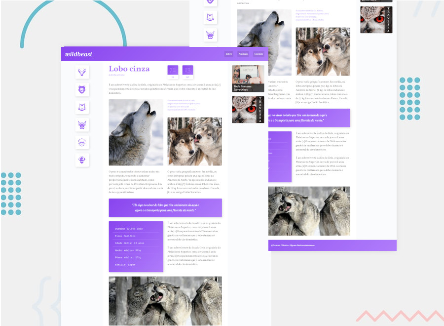

# Frontend Mentor - Time Tracking Dashboard Main ([Click Here](https://samueloliveiraa.github.io/time-tracking-dashboard-main/))

## WELCOME! 👋

This is a challenge proposed by the website **[Frontend Mentor](https://www.frontendmentor.io)** and this site is great because it helps us improve our **coding skills** with real projects and more varied difficulties. The site gives us the possibility to train any skill or web technology that we want, be it media-querie, grid layout, Jquery, React, etc..

## The Challenge 🎯

This challenge is to reproduce this **Time Tracking Dashboard Main** as close as possible to the original design.

## Technologies Used 🧩

* HTML5
* CSS3
* JavaScript
* Media-queries
* CSS Grid Layout
* Responsive Website

## Access My Resolution 💻

   I hosted this challenge with the help of GitHub Pages, to access my resolution of this challenge [Click Here](https://samueloliveiraa.github.io/time-tracking-dashboard-main/)

